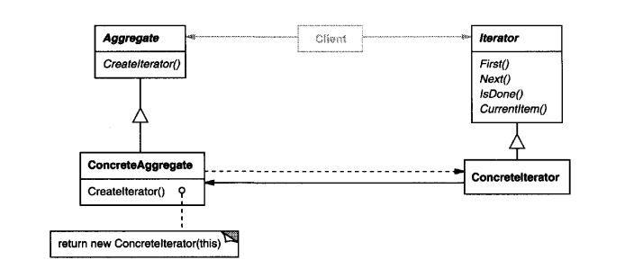

# Intent
    Provide a way to access the elements of an aggregate object sequentially without
    exposing its underlying representation, AKA Cursor.
# Structure
  

    
  

# Participants
  * Iterator(Iterator)
    - defines an interface for accessing and traversing elements.
  * Concretelterator(ListIterator)
    - implements the Iterator interface.
    - keeps track of the current position in the traversal ofthe aggregate.
  * Aggregate(Aggregate)
    - defines an interface for creating an Iterator object.
  * ConcreteAggregate(List)
    - implements the Iterator creation interface to return an instance of the
      proper Concretelterator.