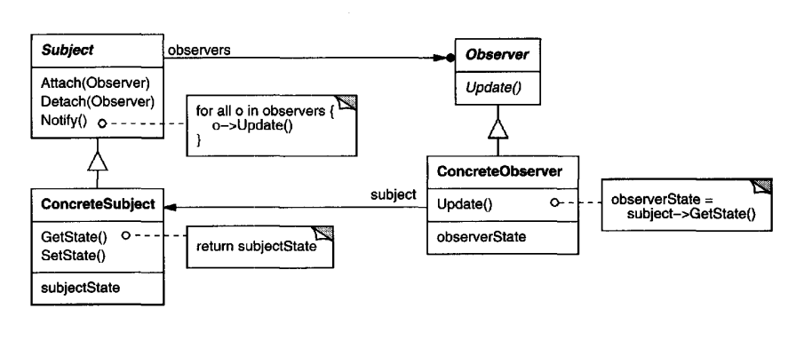

# Intent
    Define a one-to-many dependency between objects so that when one object
    changes state, all its dependents are notified and updated automatically. AKA Dependents, Publish-Subscribe
# Structure
  

    
  

# Participants
  * Suject(Subject)
    - knows its observers. Any number of Observer objects may observe a subject.
    - provides an interface for attaching and detaching Observer objects.
  * Observer(Observer)
    - defines an updating interface for objects that should be notified of changes in a subject.
  * ConcreteSubject(ConcreteSubject)
    - stores state of interest to ConcreteObserver objects.
    - sends a notification to its observers when its state changes. 
  * ConcreteObserver(ConcreteObserver)
    -maintains a reference to a ConcreteSubject object.
    - stores state that should stay consistent with the subject's.
    - implements the Observer updating interface to keep its state consistent
      with the subject's.