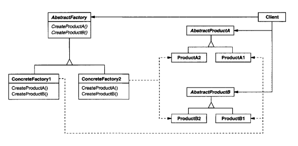

# intent

    Provide an interface for creating families of related or dependent objects without specifying their concrete classes

# Structure 

    Abstract Factory: An interface or abstract class defining methods to create abstract products.
    Concrete Factory: Implements the abstract factory to create specific product families.
    Abstract Product: Interfaces or abstract classes for the objects being created.
    Concrete Product: Specific implementations of the abstract products.
    Client: Uses the abstract factory and abstract product interfaces to work with objects without knowing their concrete types.
 

  

    