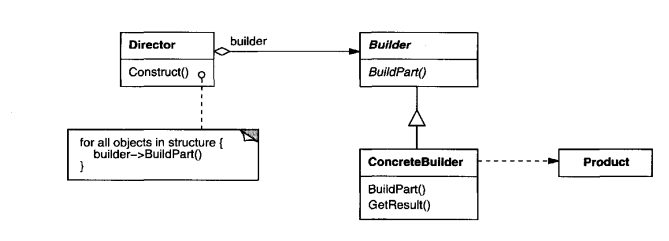

# Intent
        Separate the construction of a complex object from its representation so that the
    same construction process can create different representations.

# Structure
  

    
  

# Participants
- **Builder** (`VehicleBuilder`)
  - Specifies an abstract interface for creating parts of a Product object.
- **ConcreteBuilder** (`SUVBuilder`, `TruckBuilder`)
  - Constructs and assembles parts of the product by implementing the Builder interface.
  - Defines and keeps track of the representation it creates.
- **Director** (`Director`)
  - Constructs an object using the Builder interface.
- **Product** (`SUV`, `Truck`)
  - Represents the complex object under construction. ConcreteBuilder builds the product's internal representation and defines the process by which it's assembled.
  - Includes classes that define the constituent parts, including interfaces for assembling these parts into the final result.