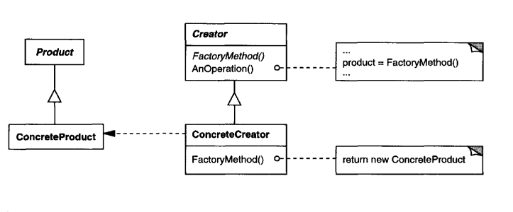

# Intent
    Define an interface for creating an object, but let subclasses decide which class to
    instantiate. Factory Method lets a class defer instantiation to subclasses.
    This is also called as Virtual constructor.

# Structure

  

# Participants
    • Product (Vehicle)
        - definesthe interface of objects the factory method creates.
    • ConcreteProduct (Car, Truck)
        - implements the Product interface.
    • Creator (VehicleFactory)
        - declares the factory method, which returns an object of type Product.
          Creator may also define a default implementation of the factory method that
          returns a default ConcreteProduct object.
        - may call the factory method to create a Product object.
    • ConcreteCreator (CarFactory, TruckFactory)
        - overrides the factory method to return an instance of a ConcreteProduct.