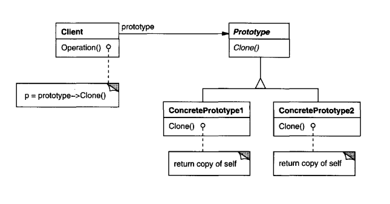

# Intent
    Specify the kinds of objects to create using a prototypical instance, and create new
    objects by copying this prototype.

# Structure

  

# Participants
* Prototype (Vehicle)
    - declares an interface for cloning itself.
* ConcretePrototype (Car, Motorcycle)
    - implements an operation for cloning itself.
* Client (main)
    - creates a new object by asking a prototype to clone itself.
