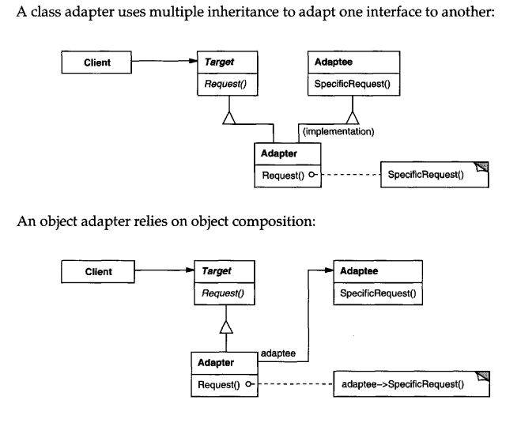

# Intent
    Convert the interface of a class to another interface clients expect. Adapter lets classes work together that couldn't otherwise because of incompatible interfaces. This pattern is also called Wrapper. 

# Structure
  

    
  

# Participants
    * Client
        - collaborates with objects conforming to the Target interface.
    * Target
        - defines domain-specific interface that Client uses.
    * Adaptee
        - defines an existing interface that needs adapting.
    * Adapter
        Adapts the interface of Adaptee to the Target interface.