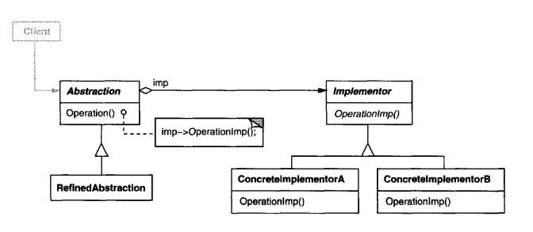

# Intent
Decouple an abstraction from its implementation so that the two can vary independently.
This pattern is also knows as Handle/Body. 

# Structure
  

    
  

# Participants
    * Abstraction
        - defines theabstraction's interface.
        - maintains a reference to an object oftype Implementor.
    * RefineddAbstraction
        - Extendsthe interface defined byAbstraction.
    * Implementor
        - defines the interface for implementation classes. This interface doesn't
        have to correspond exactly to Abstraction's interface;in fact the two interfaces can be quite different. Typically the Implementor interface provides
        only primitive operations, and Abstraction defines higher-level operations
        based on these primitives.
    * Concretelmplementor
        - implements the Implementor interface and defines its concrete implementation.