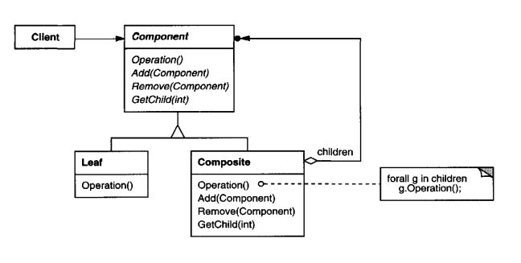

# Intent 
    Compose objects into tree structures to represent part-whole hierarchies. 
    Composite lets clients treat individual objects and compositions of objects uniformly.

# Structure
  

    
  

# Participants

    * Component (FileSystemComponent)
        - declares the interface for objectsin the composition.
        - implements default behavior for the interface common to all classes, as
            appropriate.
        - declares an interface for accessing and managing its child components.
        - (optional) defines an interface for accessing a component's parent in the
            recursive structure, and implements it if that's appropriate.
    *  Leaf (File)
        - represents leaf objects in the composition. A leaf has no children.
        - defines behavior for primitive objects in the composition.
    * Composite (Directory)
        - defines behavior for components having children.
        - stores child components.
        - implements child-related operations in the Component interface.
    * Client
        - manipulates objects in the composition through the Component interface.