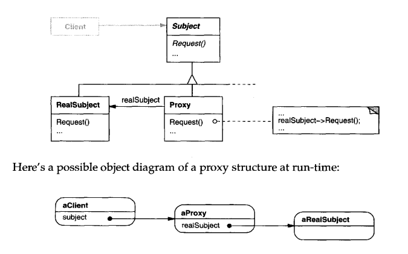

# Intent
Provide a surrogate or placeholder for another object to control access to it (AKA Surrogate)

# Structure
  

    
  

# Participants
 * Proxy (ProxyImage)
    - maintains a reference that lets the proxy access the real subject. Proxy may
        refer to a Subject if the RealSubject and Subject interfaces are the same.
    - provides an interface identical to Subject's so that a proxy can by substituted for the real subject.
    - controls access to the real subject and may be responsible for creating and
        deleting it.
 * Subject (Image)
    - defines the common interface for RealSubject and Proxy so that a Proxy
        can be used anywhere a RealSubject is expected.
 * RealSubject (RealImage)
    - defines the real object that the proxy represents.